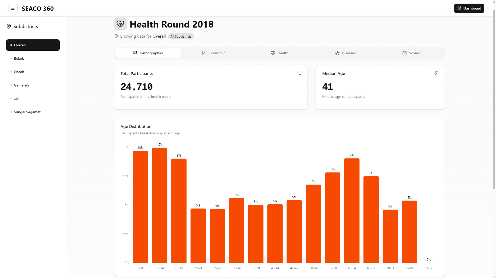
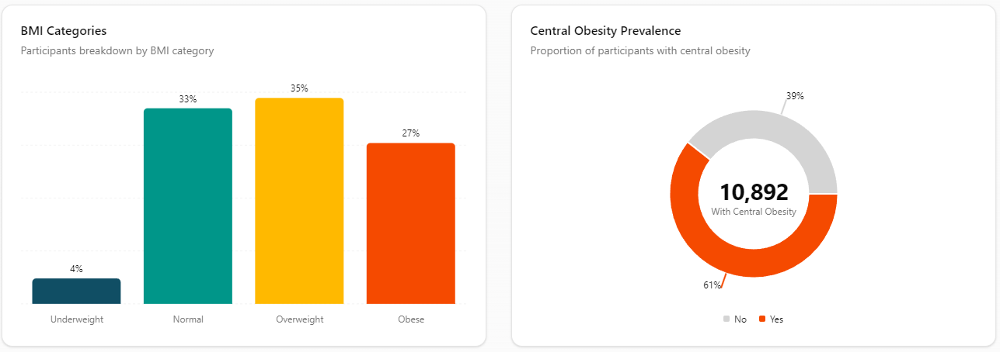
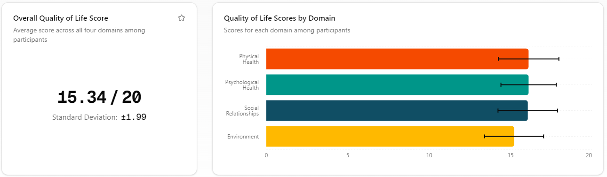

# SEACO360

<p align="center">
    
</p>
<p align="center">
    
    
</p>

An interactive Next.js and shadcn/ui dashboard to visualise data from SEACO360, a Health and Demographic Surveillance System (HDSS), enabling researchers to analyse socioeconomic and health trends without manual data processing. Automated analytics by designing a TypeScript pipeline to transform raw CSV datasets into aggregated, type-safe JSON statistics efficiently based on the provided codebook definitions and dataset configuration.

## Getting Started
1. Install Dependencies:

    ```bash
    npm install
    ```

2. Start the Development Server

    ```bash
    npm run dev
    ```
3. Open [http://localhost:3000](http://localhost:3000) with your browser to see the app.
